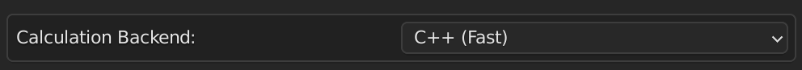
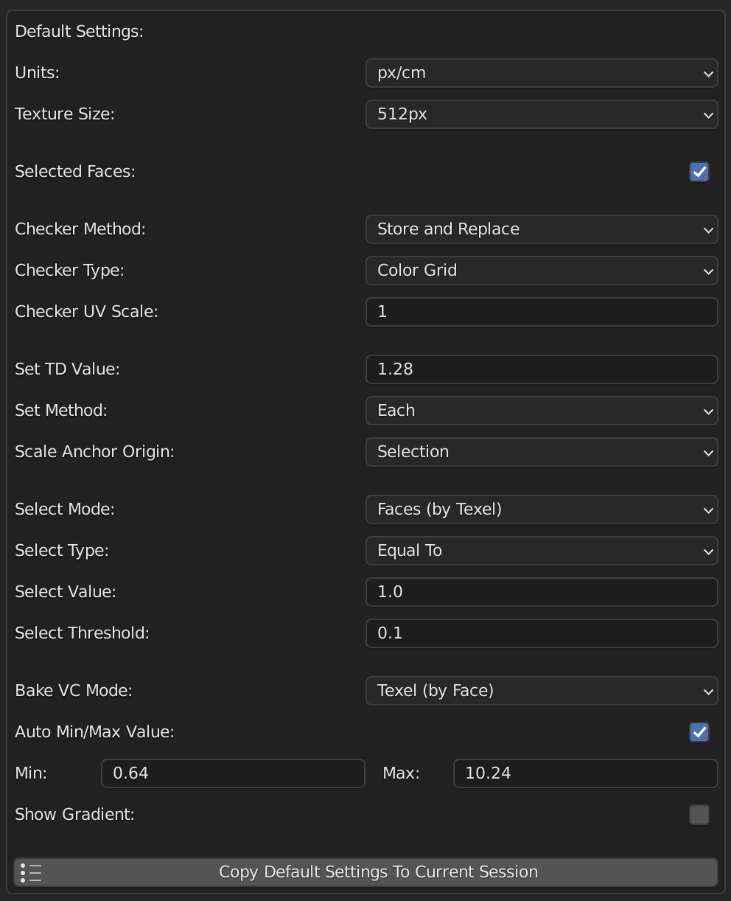

# Texel Density Checker Changelog

## Texel Density Checker 2025.1

### New

* #### New C++ backend for texel density calculations

Now Texel Density Checker uses C++ backend for texel density calculations. This is faster, but compatible not for all operating systems. Python backend is also available and automatically used if C++ library is not found or can't be loaded. You can see comparison between C++, Python and previous version on [Performance comparison charts](README.md#performance-comparison).

* #### Default settings system for the addon

In Preferences window you can set default settings for the addon. These settings will be applied to new scene.

* #### Buttons linking to Preferences, Documentation, and Bug Report

Added buttons in top of panel linking to Preferences, Documentation, and Bug Report.

* #### Basic implementation of unit tests

Added basic implementation of unit tests for Python and C++ backends. It's important for testing compatibility of the add-on with different Blender versions and operating systems. 

* #### Unified ZIP package for Blender 3.0+ compatibility

Do not understand which version of addon you need? You can download unified ZIP package for Blender 3.0+ and use it with any version of Blender. It's also compatible with Blender 4.0+.

### Changed

* #### Improved performance of Python calculations

Many of code was optimized for better performance.

* #### UI updates and layout refinements

Added Icons to buttons and some UI refinements.

* Codebase refactored for better structure and readability

### Fix

* #### Fixed operators working incorrectly with multi-user data

Calculation of TD early works with duplicate meshes, but now it works directly with original mesh. It's fixed problems with multi-user data nd improved speed.

* Various minor bugfixes and stability improvements

## Texel Density Checker 2023.2

### New

* Added Link to Documentation

### Fix

* Show Gradient doesn't work on Blender 4.0
* "Auto Min/Max Value" for VC baking doesn't working
* Many Small Fixes

## Texel Density Checker 2023.1

### New

* ##### Select anchor for scaling UV when using "Set TD"

Select Origin for Rescale UV: Average of Selection, Corner of UV, Center of UV or 2D Cursor. Before that Rescale origin was from average of selection of UV.

* ##### Visualization of Distortion UV

Shows the ratio between the percentage of UV occupied area and the percentage of the object's geometry area.

* ##### Ability to remove panel from 3D Viewport or UV Editor

Added options to Preferences for hiding Texel Density Panel from View 3D or UV Editor.

* ##### Added Debug Mode for tracking function execution time

Print function execution time to console. For enabling this function enter to console bpy.context.scene.td.debug = True

### Changed

* ##### Changed Version Numbering

This and next version will have contains current year and number of release in this year. For example, current release is 2023.1. I switched to a new version numbering so as not to confuse the add-on version and the Blender version.

* 25% speed increase

* ##### Update "Report a Bug" link 

A button "Report Bug" in add-on preferences now open GitHub issues page. This is best way to report bug or suggest your enhancement. Welcome!

### Fix

* ##### Clean Up orphan mesh data

No more orphan mesh data after using Texel Density Checker.

* Fix Automatic calculation option in Preferences
* TD is wrong if parent has scale not 1 (in some cases)

## Texel Density Checker 3.4

### Changed

* Added commentaries for all code

### Fix

* Blender 3.4 Support

## Texel Density Checker 3.3.1

### Changed

* Closest Interpolation for TD Material's Grid Texture

### Fix

* Blender 3.0 Support

## Texel Density Checker 3.3

### New

* [Bake TD to VC] Automatic Min/Max TD Values from Selected Objects
* [Set TD] Presets "Half" and "Double" (works better with Average Set Method)

### Fix

* Incorrect TD if selected Non-Mesh Objects
* Face Maps are Empty after using "Assign Checker Material"

## Texel Density Checker 3.2.2

### Fix

* Incorrect Calculation of average TD when islands have different TD

## Texel Density Checker 3.2.1

### Changed

* Small Improvements

### Fix

* Operators don't work if enable edit mode from outliner

## Texel Density Checker 3.2

### New

* [Checker Material] New Option "UV Scale" for changing Tiling of Checker Texture (Very Useful with "UV Grid" Checker Texture Type)

### Fix

* [Logic] Error for some operators if Object has no polygons
* [Set TD] Default TD value is 0
* [UI/UX] Image Editor Window switched to Console if opened several Image Editor Windows

## Texel Density Checker 3.1

### New

* [UI/UX] Changing Category for Panels from Preferences

### Changed

* [UI/UX] Default Checker Mode is "Store and Replace"
* [UI/UX] "Restore Materials" and "Clear Stored Face Maps" Buttons is hidden if current mode is "Replace"
* [UI/UX] Improvements of UI/UX. Reorganizing UI Panels
* [UI/UX] Hide "Texel Density Checker" Panel in UV Editor if current mode is not Edit Mesh

## Texel Density Checker 3.0

### New

* [Baking to VC] Baking UV Space for Each Islands to VC
* [Baking to VC] Baking TD by Island to VC
* [Baking to VC] Two Modes for Baking UV Islands to VC - By Island and By Overlap
* [Select] New Selection Modes - Faces By TD, Islands By TD, Islands By UV Space
* [Select] Reworked "Select by TD/UV Space". Added some Selection Types: Equal To (with Treshold), Less To and Greater To
* [Select] Copy Calculated TD/UV Space value to "Select Value" field
* [Preferences] Optional Enable/Disable "Calling Select/Bake VC operator after changing Mode/Value". By Default is Disabled

### Changed

* [Logic] Optimization Calculation TD and UV Space to List
* [Logic] More Accurate Calculation of Average TD
* [Logic] Refactoring of Code - Unified Variables Names, Multi File Structure of Addon
* [UI/UX] Improvements of UI/UX. Reorganizing UI Panels. Now UI is more compact and more readable
* [UI/UX] Filtering "Density Set" value
* [UI/UX] Filtering "Custom Texture Size" value
* [UI/UX] Precision of showing Gradient Values for Baking to VC now depends from range
* [Other] Many small improvements

### Fix

* [Logic] Incorrect Calculation TD for Complicated N-Gons
* [Logic] Infinite recurcive call when updating values in the fields
* [Other] Many small fixes

## Texel Density Checker 2.3

### New

* Visualize UV Islands with Random Vertex Color in Viewport
* New Option for "Bake TD to Vertex Colors" - Show Gradient with Intermadiate Values (0%, 25%, 50%, 75%, 100% of TD Range)

## Texel Density Checker 2.2.1

### Changed

* Increase performance for "TD to Vertex Colors"
* Increase performance for "Select Faces with same TD"
* More accuracy calculation for N-gons

## Texel Density Checker 2.2

### New

* Baking Texel Density Value to Vertex Colors

### Changed

* Change Checker Texture Type - Color Grid or UV Grid

## Texel Density Checker 2.1

### Changed

* Now Addon works correctly on all platforms (Windows, Linux, MacOS)
* "Assign Checker Material" rewritten. Now for storing material assignments use Face Maps on each object
* "Restore Materials" now works only for selected objects

## Texel Density Checker 2.0

### New

* Interactive Checker Material - Assigment Material with checker texture. Texture dynamically changes if you change "Texture Size" on Texel Density UI Panel. This feature have two modes:
* Texel Density UI Panel in UV Editor Window - Now you can directly operate with faces in UV Editor without Sync Selection Mode.
* TD Checker works with MultiEdit (both modes - 3D View and UV Editor)

### Changed

* UI is more flexibility
* "Selected Faces" option is true by default
* Change Texture Size or Units value calls recalculate TD
* Refactoring of Code

### Fix

* Error if Custom Texture size equals 0 or negative
* Error if Calculated Value is very small
* "TD from Active to Others" change UV on Active Object