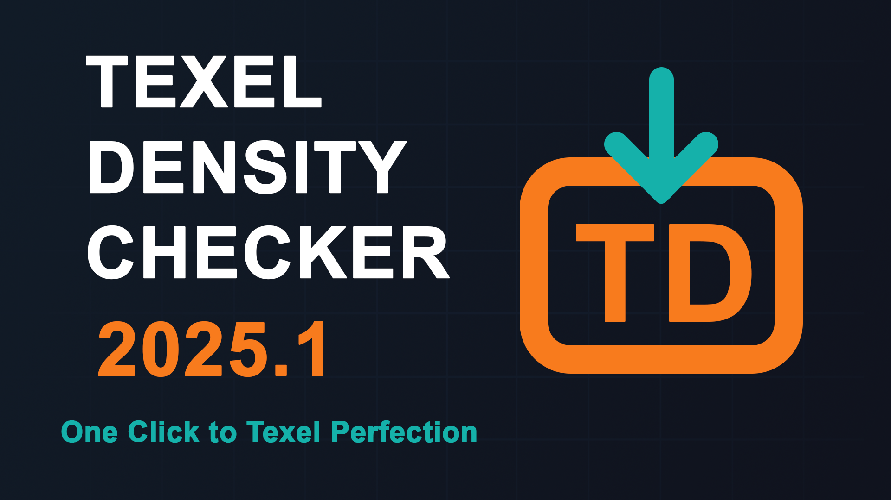
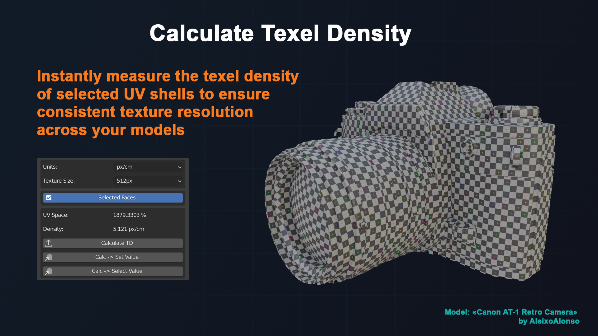
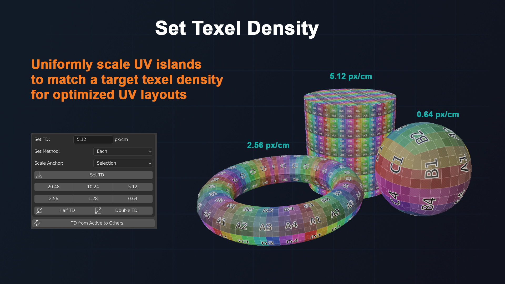
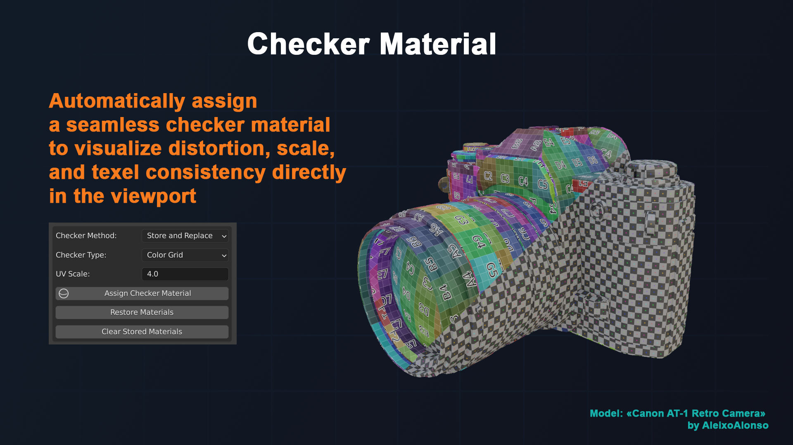
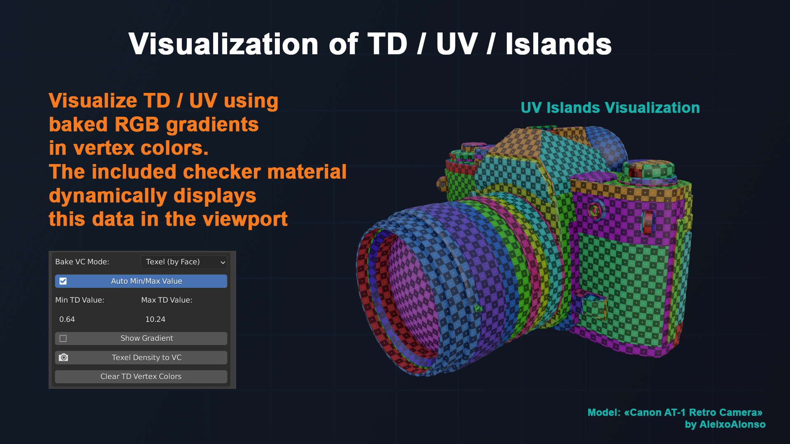

# Blender Addon: Texel Density Checker

With **Texel Density Checker** you can: 

* Calculate Texel Density for model for different texture size (includes non-squared textures and custom size)
* Rescale UV for getting texel density what you want
* Copy Texel Density from one object to others
* Select faces for same Density
* Vizualize Texel Density with Cheker material and vertex color

Texel Density Checker simple for use. You need select your mesh (or faces) and texture size and just click button.

## ***Download latest version:***

* ***[(2025.1) Blender 4.2+ (from Blender Extensions)](https://extensions.blender.org/add-ons/texel-density-checker/)***
* ***[(2025.1) Blender 3.0++ (even 4.5+)](https://github.com/mrven/Blender-Texel-Density-Checker/raw/master/Releases/texel_density_2025_1.zip)***
* ***[(3.3.1) Blender 2.91+](https://github.com/mrven/Blender-Texel-Density-Checker/raw/master/Releases/Texel_Density_3_3_1_291.zip)***
* ***[(3.2.1) Blender 2.83-2.90](https://github.com/mrven/Blender-Texel-Density-Checker/raw/master/Releases/Texel_Density_3_2_1_283.zip)***
* ***[(1.0.9) Blender 2.79](https://github.com/mrven/Blender-Texel-Density-Checker/raw/master/Releases/Texel_Density_1_0_9_279.zip)***

If you want to support me you can buy this addon:
* ***[Superhive](https://superhivemarket.com/products/texel-density-checker)***
* ***[Gumroad](https://mrven.gumroad.com/l/CEIOR)***

## New in Texel Density Checker 2025.1

#### New

* New C++ backend for texel density calculations
* Default settings system for the addon
* Buttons linking to Preferences, Documentation, and Bug Report
* Basic implementation of unit tests
* Unified ZIP package for Blender 3.0+ compatibility

#### Changed

* Improved performance of Python calculations
* UI updates and layout refinements
* Codebase refactored for better structure and readability

#### Fix

* Fixed operators working incorrectly with multi-user data
* Various minor bugfixes and stability improvements

[See full CHANGELOG](CHANGELOG.md)

## Documentation

[Install Addon](./docs/install_addon.md)

[Help Panel](./docs/help_panel.md)

[Texel Units & Texture Size](./docs/texel_units.md)

[Calculate Texel Density](./docs/calculate_td.md)

[Set Texel Density](./docs/set_td.md)

[Interactive Checker Material](./docs/checker_material.md)

[Bake TD/UV/Islands to VC](./docs/bake_td.md)

[Select Faces by TD/UV](./docs/select_by_td.md)

[Addon Preferences](./docs/preferences.md)

[How to report a bug?](./docs/bug_report.md)

## Features Overview

