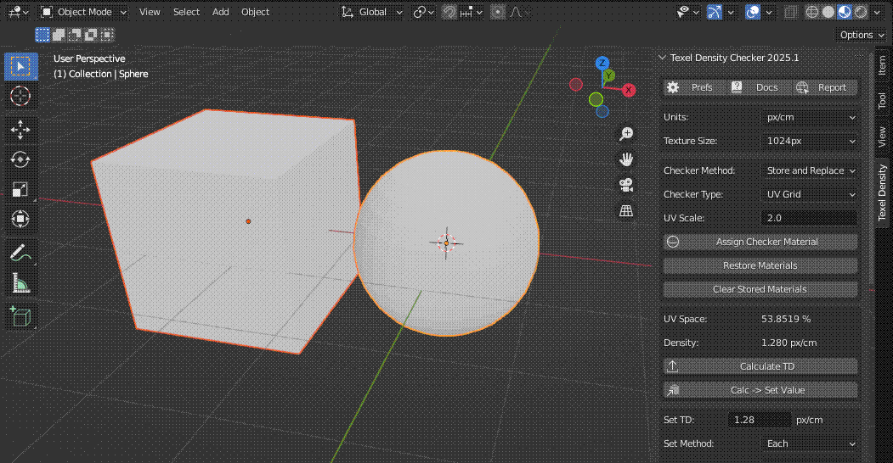

[<< Return to README](../README.md#documentation)

# Bake TD/UV/Islands to Vertex Color

Bake TD/UV/Islands data to Vertex Color, which can be shown in the 3D Viewport with [Interactive Checker Material](checker_material.md).

# UI Elements and Functionality

### Bake VC Mode

What data to bake to Vertex Color.

| Value              | Description                                           |
|--------------------|-------------------------------------------------------|
| Texel (by Face)    | Bake Texel Density value for each face                | 
| Texel (by Islands) | Bake Texel Density value for each island              |
| UV Islands         | Bake Visualization of UV Islands (1 island = 1 color) |
| UV Space (%)       | Bake percentage of UV space used by each island       |
| UV Distortion      | Bake UV Distortion value for each island              |

### Auto Min/Max Value (Texel modes only)

Auto calculate min and max value for visualization of Texel Density from selected faces or entire object.

### Min/Max Value (Texel and UV Space modes only)

Set min and max value for visualization of Texel Density or UV Space.

### Island Detect Mode (UV Islands mode only)

How to detect UV islands.

| Value      | Description                                                                              |
|------------|------------------------------------------------------------------------------------------|
| By Island  | Each is colored with a different color                                                   | 
| By Overlap | Overlapping UV islands are colored with the same color. Works for each object separately |

### Range (UV Distortion mode only)

Set range for visualization of UV Distortion.

### Show Gradient (except UV Islands mode)

Toggle to display a color gradient overlay in the 3D Viewport based on the baked data.

### Texel Density/UV Islands/UV Space/UV Distortion to VC

Run Bake Texel Density/UV Islands/UV Space/UV Distortion to Vertex Color operator.

### Clear TD Vertex Color

Clear TD Vertex Color only for selected objects.

# Usage Examples

