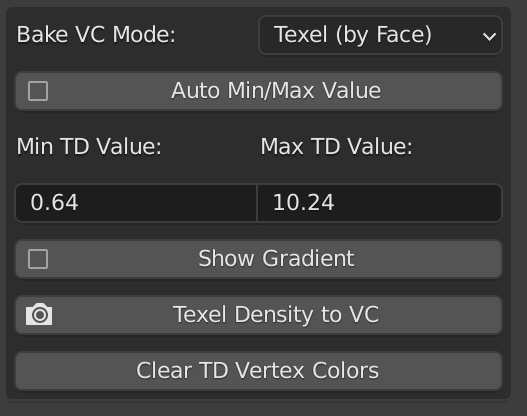
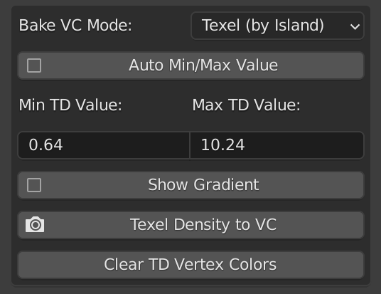
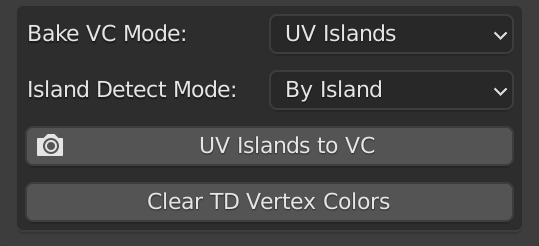
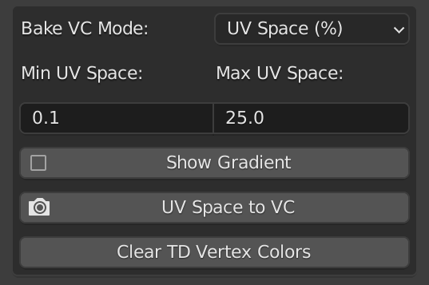
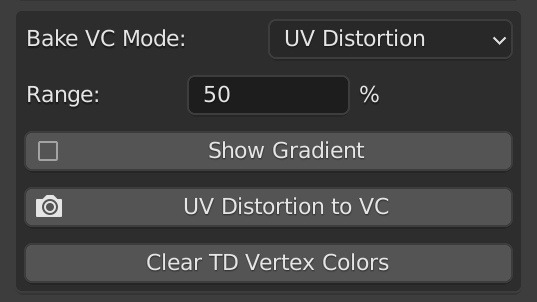
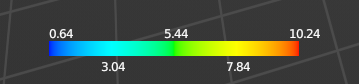

[<< Return to README](../README.md#documentation)

# Bake TD/UV/Islands to Vertex Color

# UI Elements and Functionality

### Bake VC Mode

| Value              | Description |
|--------------------|-------------|
| Texel (by Face)    | aaa         | 
| Texel (by Islands) | aaa         |
| UV Islands         | aaa         |
| UV Space (%)       | aaa         |
| UV Distortion      | aaa         |

### Auto Min/Max Value (Texel modes only)

### Min/Max Value (Texel and UV Space modes only)

### Island Detect Mode (UV Islands mode only)

| Value      | Description |
|------------|-------------|
| By Island  | aaa         | 
| By Overlap | aaa         |

### Range (UV Distortion mode only)

### Show Gradient (except UV Islands mode)

### Texel Density/UV Islands/UV Space/UV Distortion to VC

### Clear TD Vertex Color

# Usage Examples