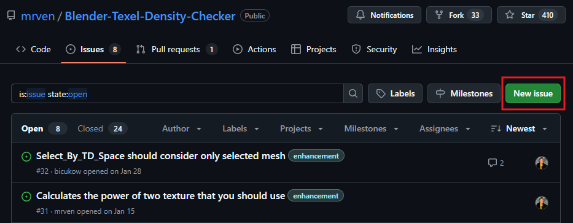

[<< Return to README](../README.md#documentation)

# How To Report a Bug?

If you have found a bug in Texel Density Checker or have a suggestion, please [open an issue](https://github.com/mrven/Blender-Texel-Density-Checker/issues) on GitHub.

## If you have found a bug in Texel Density Checker

Please provide following information:

* Texel Density Checker version
* Blender version
* Operating system
* Steps to reproduce the bug
* Stack trace (Error Messages from console window) (if available)
* If you have a screenshot, please attach it
* If this bug reproduce in specific blend file, please attach it

When more information is provided, the bug will be fixed as soon as possible.

## If you have a suggestion

If you have suggestion or enhancement, please, try to provide detailed description of your idea, expected result and possible use cases.

# Thanks for your help!