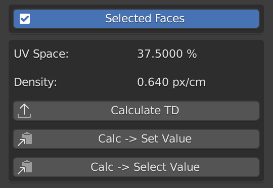

[<< Return to README](../README.md#documentation)

# Calculate Texel Density

The Calculate TD function is used to analyze the texel density of objects or selected faces. This feature is essential for ensuring consistent texture detail and scale across your models, especially for game assets or high-fidelity renders.

If the object is in Edit Mode, the calculation will be performed only on selected faces. Otherwise, the operator processes the entire object. This flexibility allows for both localized and global texel density analysis.

# UI Elements and Functionality

### Selected Faces (Edit mode only)

Toggle to limit calculations to selected faces in Edit Mode. If Selected Faces is disabled, the operator processes the entire object.

### UV Space

Show UV Soace percentages for selected faces or entire objects.

### Density

Show average texel density for selected faces or entire objects.

### Calculate TD

Calculates texel density for selected faces or entire objects.

### Calc -> Set Value

Copy value from the calculated texel density field to the Set Value field.

### Calc -> Select Value (Edit mode only)

Copy value from the calculated texel density field to the Select Value field.

# Usage Examples

