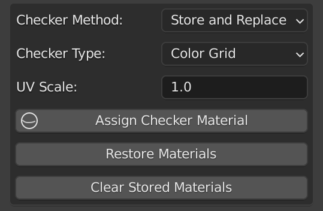

[<< Return to README](../README.md#documentation)

# Interactive Checker Material

# UI Elements and Functionality

### Checker Method

| Value             | Description |
|-------------------|-------------|
| Store and Replace | aaa         | 
| Replace           | aaa         |

### Checker Type

| Value      | Description |
|------------|-------------|
| Color Grid | aaa         | 
| UV Grid    | aaa         |

### UV Scale

### Assign Checker Material

### Restore Materials

### Clear Stored Materials

# Usage Examples