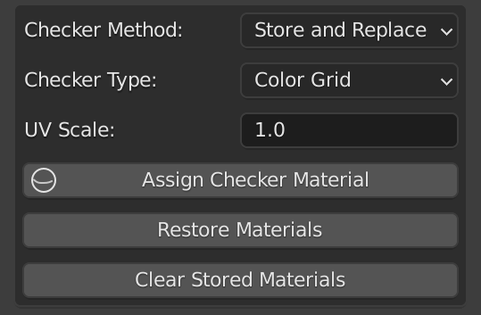
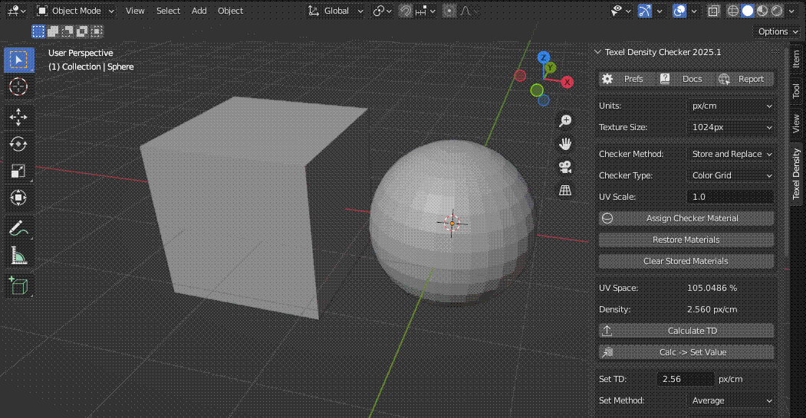

[<< Return to README](../README.md#documentation)

# Interactive Checker Material

This feature assigns a material with a checker texture. Generated checker textures dynamically change when you update "Texture Size" in the Texel Units and Texture Size UI panel. Custom checker images are used without modification. The material can also visualize data from the [Bake TD/UV/Islands to Vertex Color](bake_td.md) operator.

# UI Elements and Functionality

### Checker Method

How Checker Material assignment works.

| Value             | Description                                                                                                                                                                                                         |
|-------------------|---------------------------------------------------------------------------------------------------------------------------------------------------------------------------------------------------------------------|
| Store and Replace | Save assignments of current materials on object. Then Checker material is assigned to object and applied to all faces. Restore Materials button is restore saved materials and delete Checker Material from object. | 
| Replace           | Remove all materials from object and assign Checker Material to all faces.                                                                                                                                          |

### Checker Type

Type of Checker Texture.

| Value      | Description                                                   |
|------------|---------------------------------------------------------------|
| Color Grid | Blender's default generated Color Grid texture                |
| UV Grid    | Blender's default generated UV Grid texture                   |
| Custom     | An image selected from the current Blender file or loaded from disk |

### Custom Image

Available when Checker Type is set to Custom. Use the image selector to choose an existing image or the folder button to load one from disk. The add-on does not modify the selected image. Pack external images into the `.blend` file if the project needs to be portable.

### UV Scale

Additional UV scale for Checker Texture.

### Assign Checker Material

Assign Checker Material to selected object. For show Checker Material you need to change Viewport Shading to "Material Preview".

### Restore Materials (Store and Replace method only)

Restore saved materials and delete Checker Material from object.

### Clear Stored Materials (Store and Replace method only)

Clear saved materials from selected object. 

> [!CAUTION]
> This operation may lose saved materials.

# Usage Examples

