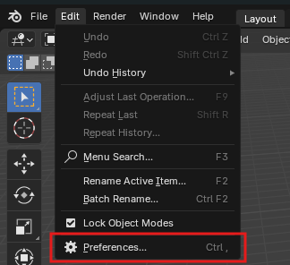
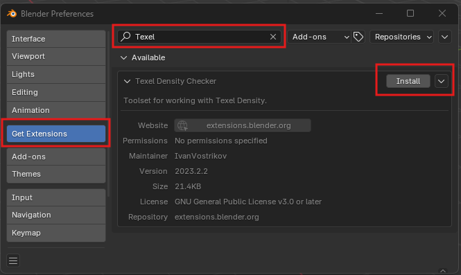
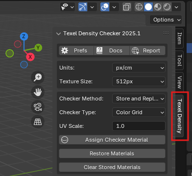
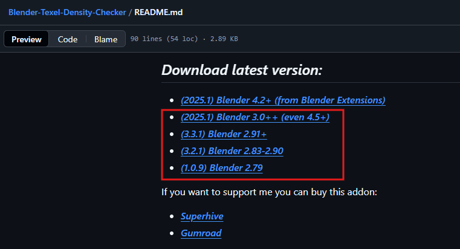
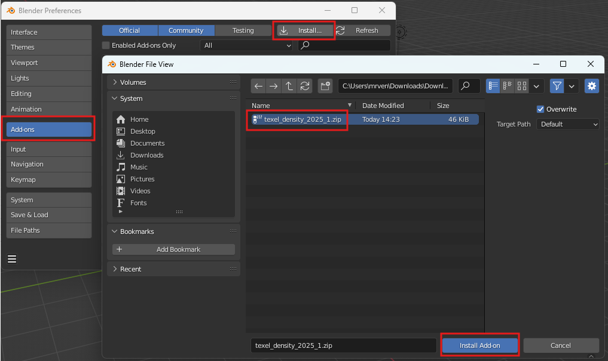

[<< Return to README](../README.md#documentation)

# How to Install Texel Density Checker?

You can install Texel Density Checker by two ways:

1. Install directly from [Blender Extensions](https://extensions.blender.org/add-ons/texel-density-checker/) (for Blender 4.2+)
2. Download Zip from [GitHub](../README.md#download-latest-version), [Gumroad](https://mrven.gumroad.com/l/CEIOR) or [Superhive](https://superhivemarket.com/products/texel-density-checker) and install it manually

## How to install from Blender Extensions (Blender 4.2+)

1. Open **Blender Preferences** (Edit > Preferences).

2. In **Get Extensions** tab, search for **Texel Density Checker** and click **Install**.

3. After installation, you can find **Texel Density Checker** in **N-Panel** of **3D View** and **UV Editor**.

## How to install from GitHub (Blender 3.0+)

1. Download **Texel Density Checker zip-file** from [README.md](../README.md#download-latest-version) for your Blender version.

2. Open **Blender Preferences** (Edit > Preferences).

3. In **Add-ons** tab, click **Install** and select **downloaded zip-file**.

4.After installation, you can find **Texel Density Checker** in **N-Panel** of **3D View** and **UV Editor**.

> [!NOTE]
> You can also download it from [Gumroad](https://mrven.gumroad.com/l/CEIOR) or [Superhive](https://superhivemarket.com/products/texel-density-checker)