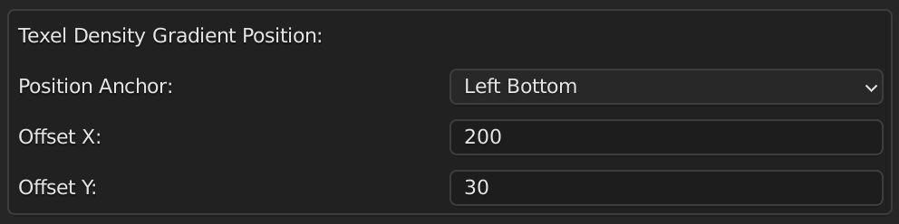
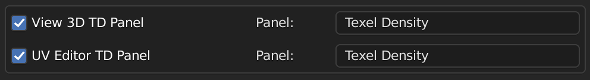

[<< Return to README](../README.md#documentation)

# Addon Preferences

Texel Density Checker preferences window with following options:
* Calculation Backend
* Default Settings
* Texel Density Gradient Position
* Panels Category and Visibility
* Auto Select/Bake VC when changed Mode/Value

# UI Elements and Functionality

## Calculation Backend

Calculation backend for texel density calculations. If C++ is selected, but library isn't found, then Python will be used.

### Calculation Backend

Select calculation backend.

| Value  | Description                                                               |
|--------|---------------------------------------------------------------------------|
| C++    | Precompiled library. Faster, but compatible not for all operating systems | 
| Python | Python script. Slower, but compatible for all operating systems           |

## Default Settings

Default settings for Texel Density Checker, which will be applied to all new scenes.

### Default Values

Values for default settings.

### Copy Default Settings To Current Session

Copy default settings to current Blender session.

## Texel Density Gradient Position

Coordinates of Viewport for [Gradient](bake_td.md#show-gradient-except-uv-islands-mode).

### Position Anchor

Position anchor for gradient position. From this point gradient position will be calculated.

| Value        | Description                     |
|--------------|---------------------------------|
| Left Top     | Left Top corner of Viewport     | 
| Left Bottom  | Left Bottom corner of Viewport  |
| Right Top    | Right Top corner of Viewport    |
| Right Bottom | Right Bottom corner of Viewport |

### Offset X

Offset by X from anchor for gradient position.

### Offset Y

Offset by Y from anchor for gradient position.

## Panels Category and Visibility

Settings for 3D View and UV Editor panels category and visibility.

### View 3D TD Panel

Category name and visibility for 3D View panel.

### UV Editor TD Panel

Category name and visibility for UV Editor panel.

## Auto Select/Bake VC when changed Mode/Value

### Calling Select/Bake VC operator after changing Mode/Value

Auto recalculate VC when changing Mode/Value in [Bake TD/UV/Islands Panel](bake_td.md).

> [!CAUTION] 
> Auto recalculate VC may cause a lot of lag when changing Mode/Value.

## Reset Preferences

### Reset Preferences

Reset all preferences to default values.