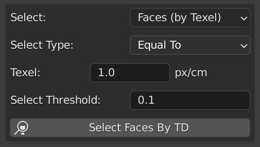
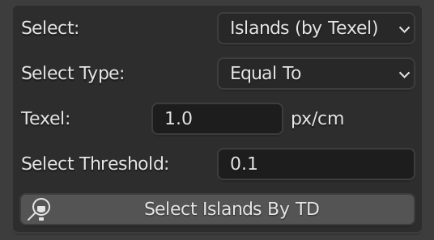
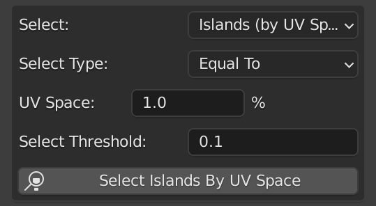

[<< Return to README](../README.md#documentation)

# Select Faces by TD/UV

Select faces by Texel Density or UV Space values in edit mode.

# UI Elements and Functionality

### Select

Select mode for faces or islands.

| Value                 | Description                           |
|-----------------------|---------------------------------------|
| Faces (by Texel)      | Select faces by Texel Density value   | 
| Islands (by Texel)    | Select islands by Texel Density value |
| Islands (by UV Space) | Select islands by UV Space percentage |

### Select Type

Comparison type for selection.

| Value        | Description                                |
|--------------|--------------------------------------------|
| Equal To     | Equal to the selected value with threshold | 
| Less Than    | Less than the selected value               |
| Greater Than | Greater than the selected value            |

### Texel / UV Space

Value for comparison and selection.

### Select Threshold (Equal To type only)

Threshold for Equal To comparison type.

### Select Faces/Islands By TD/UV Space

Run Select Faces/Islands By TD/UV Space operator.

# Usage Examples