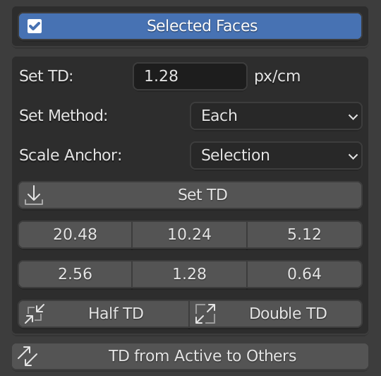

[<< Return to README](../README.md#documentation)

# Set Texel Density

# UI Elements and Functionality

### Selected Faces (Edit mode only)

### Set TD

### Set Method

| Value   | Description |
|---------|-------------|
| Each    | aaa         | 
| Average | aaa         |

### Scale Anchor

| Value           | Description |
|-----------------|-------------|
| Selection       | aaa         | 
| UV Center       | aaa         |
| UV Left Bottom  | aaa         |
| UV Left Top     | aaa         |
| UV Right Bottom | aaa         |
| UV Right Top    | aaa         |
| 2D Cursor       | aaa         |

### Set TD

### Presets Value Buttons

### Half/Double TD

### TD from Active to Others (Object mode only)

# Usage Examples