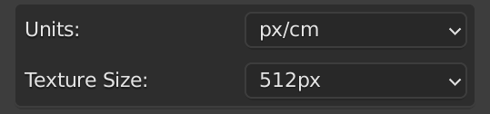
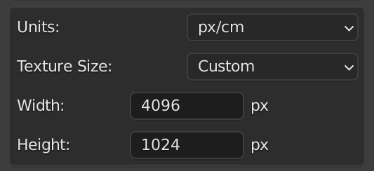

[<< Return to README](../README.md#documentation)

# Texel Units and Texture Size

This section defines how texel density is calculated, based on the measurement units and texture resolution.

# UI Elements and Functionality

### Units

| Value | Description          |
|-------|----------------------|
| px/cm | pixels by centimeter | 
| px/m  | pixels by meter      |
| px/in | pixels by inch       |
| px/ft | pixels by feat       |

### Texture Size

| Value         | Description |
|---------------|-------------|
| 512 - 4096 px | aaa         | 
| Custom        | aaa         |

### Width (Custom Size only)

### Height (Custom Size only)

# Usage Examples